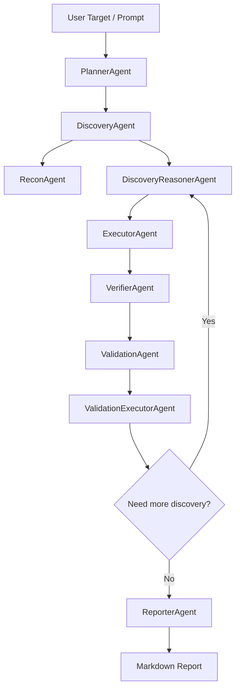

# AutoFlow

AutoFlow 是一个面向**授权安全评估、靶场测试和内部红队演练**的多 Agent 渗透测试自动化框架原型。项目使用 LangGraph 编排工作流，接入 OpenAI-compatible LLM 做规划、推理和工具调用决策，并通过 Docker 工具容器执行安全工具。Redis 用于运行时记忆与 LangGraph checkpoint，为多轮推进、中断恢复和后续审批流打基础。

> 本项目仅适用于已授权目标、靶场环境或内部安全评估。请勿用于未授权系统。

## 项目定位

AutoFlow 的目标不是简单封装几个扫描命令，而是把一次安全评估拆成可追踪、可复盘、可扩展的自动化流程：

- 根据用户输入的目标、范围和测试意图创建评估任务。
- 自动收集端口、Web 页面、路径、API、安全头、技术栈等信息。
- 让 LLM 基于已有上下文、记忆和工具清单分析攻击面。
- 生成下一步测试计划，并调用容器内工具执行。
- 将工具输出沉淀为结构化观测 `ToolObservation`。
- 从观测中提取候选脆弱点 `Finding`。
- 为候选 Finding 生成验证计划 `ValidationPlan`。
- 执行验证动作，形成 `ValidationResult`。
- 汇总资产、证据、验证结果和建议，生成 Markdown 报告。

## 整体框架

AutoFlow 的整体框架可以理解为一个“LLM 推理 + LangGraph 状态机 + Docker 工具执行 + Redis 记忆”的安全评估系统。它不是把所有逻辑写死成固定脚本，而是把目标、上下文、工具结果、候选漏洞和验证计划都沉淀到统一状态中，再由不同 Agent 在同一条工作流里协作推进。

整体由五层组成：

```text
用户输入层
  -> 接收目标、授权范围、测试意图、运行参数

工作流编排层
  -> LangGraph 负责 Agent 节点编排、状态流转、分支路由和 checkpoint

Agent 推理层
  -> Planner / DiscoveryReasoner / Verifier / Validation / Reporter
  -> 使用 LLM、工具观测和 memory pack 做任务规划、攻击面分析和漏洞验证决策

工具执行层
  -> ToolDispatcher / Executor / ScriptRunner / ShellRunner
  -> 在 Docker 工具容器内执行 nmap、nuclei、nikto、curl、sqlmap、semgrep 等工具

记忆与产物层
  -> Redis 保存运行时记忆和 LangGraph checkpoint
  -> data/artifacts 保存原始证据
  -> data/reports 输出 Markdown 报告
```

核心设计思想：

- **Planner 负责顶层计划**：理解用户目标和授权范围，创建初始评估流。
- **Recon 负责事实采集**：执行确定性扫描和 Web 页面结构采集，不依赖 LLM 做复杂推理。
- **DiscoveryReasoner 负责攻击面分析**：读取 recon、历史记忆、工具清单和已有 Finding，由 LLM 生成下一步 TestPlan。
- **Executor 负责工具落地**：把 TestPlanAction 转成容器内工具调用、脚本执行或受控 shell 执行。
- **Verifier 负责结果提升**：把工具输出中的风险信号转换成候选 Finding。
- **Validation 负责漏洞确认策略**：为候选 Finding 生成复现和验证动作。
- **Reporter 负责最终汇总**：把资产、证据、Finding、验证结果和建议整理成报告。

简化后的框架关系：

```text
User Prompt / Target
  -> LangGraph Workflow
  -> Multi-Agent Reasoning
  -> Function Calling Tools
  -> Docker Tool Container
  -> ToolObservation / Finding / ValidationResult
  -> Redis Memory + Artifacts
  -> Report
```

## 当前能力

- LangGraph 多阶段 Agent 工作流。
- OpenAI-compatible LLM 接入。
- LLM function calling 工具调用循环。
- Docker 容器内工具执行，不让 LLM 直接调用宿主机 shell。
- Redis runtime memory，保存 flow 状态、事件、观测结果、Finding 和验证计划。
- LangGraph Redis checkpointer，为后续 resume 和审批后继续执行打基础。
- Web recon 页面结构采集，包括标题、链接、表单、脚本、robots、sitemap 等。
- 工具观测统一抽象为 `ToolObservation`。
- 工具观测可提升为候选 `Finding`。
- 候选 Finding 可生成 `ValidationPlan`。
- ValidationExecutor 可执行部分验证动作并生成 `ValidationResult`。
- Markdown 报告输出。

## 工作流



核心数据流：

```text
Tool Output
  -> ToolObservation
  -> ToolSignal
  -> Candidate Finding
  -> ValidationPlan
  -> ValidationResult
  -> Report
```

## Agent 职责

### PlannerAgent

理解用户输入、授权范围和测试目标，创建初始 `AssessmentFlow` 和基础任务。Planner 负责确定顶层评估方向，不直接执行扫描或验证。

### DiscoveryAgent

发现阶段入口，组合基础 recon 和 LLM 推理：

- `ReconAgent` 负责确定性信息采集。
- `DiscoveryReasonerAgent` 负责基于上下文分析攻击面并生成测试计划。

### ReconAgent

执行基础探测动作，例如端口扫描、Web 页面结构采集、技术栈识别等。它更接近工具编排器，不承担复杂 LLM 推理。

### DiscoveryReasonerAgent

真正的 discovery 推理 Agent。它会读取资产、Web recon、工具观测、Finding、Redis memory pack 和工具清单，然后输出攻击面、优先级和 discovery 阶段 `TestPlan`。

### ExecutorAgent

根据 `TestPlanAction` 调用容器内工具。工具真实风险以 `configs/tools.yaml` 中的 profile 为准，避免 LLM 错误标注风险。

### VerifierAgent

从工具输出中识别明确风险信号，将原始工具结果转换为候选 Finding。它负责判断“扫描结果是否值得进一步验证”。

### ValidationAgent

根据候选 Finding 类型生成验证计划，例如 API 暴露、目录 listing、debug endpoint、弱安全头、公开配置文件、CORS 配置等。

### ValidationExecutorAgent

执行验证计划中的动作，收集证据，并更新 Finding 状态。这个阶段更接近“确认是否存在漏洞”，而不是单纯扫描。

### ReporterAgent

汇总资产、工具观测、Finding、验证计划、验证结果和建议，生成 Markdown 报告。

## 工具调用模型

AutoFlow 不让 LLM 直接执行系统命令。LLM 只能看到工具 schema 和工具说明，并通过 function calling 发起工具调用。

```text
LLM
  -> tool_calls
  -> ToolDispatcher
  -> Docker Tool Container / WebRecon / ScriptRunner / Memory Tools
  -> tool result
  -> LLM continues reasoning
```

命令行工具、shell 动作和脚本动作都应在 Docker 工具容器中执行，不直接使用宿主机 shell。

## 已暴露的工具类型

### 目标扫描与验证工具

- `nmap`
- `curl`
- `whatweb`
- `httpx`
- `nikto`
- `nuclei`
- `dirsearch`
- `gobuster`
- `ffuf`
- `feroxbuster`
- `naabu`
- `subfinder`
- `testssl.sh`
- `sslscan`
- `wafw00f`
- `sqlmap`
- `hydra`
- `medusa`
- `smbclient`
- `enum4linux`
- `smbmap`

### 源码与制品分析工具

- `trivy`
- `bandit`
- `gitleaks`
- `semgrep`

### 内置工具

- `web_recon_fetch_page`
- `run_shell__bounded_bash`
- `read_agent_memory`
- `list_known_targets`
- `search_observations`
- `run_script__security_headers_check`
- `run_script__api_endpoint_probe`
- `run_script__cors_probe`
- `run_script__debug_endpoint_probe`
- `run_script__directory_listing_probe`
- `run_script__public_config_probe`

## 记忆机制

AutoFlow 当前包含两类持久化能力。

### Redis Runtime Memory

用于保存评估过程中的运行时记忆：

```text
latest_state
memory_pack
events
observations
findings
validation_plans
```

每个关键 Agent 执行前会读取并合并 Redis 中的 `memory_pack`，执行后再刷新记忆。这样 Agent 不会只看到当前进程里的状态，而是能继承前面扫描、观测和验证过程。

### LangGraph Redis Checkpointer

用于保存 LangGraph checkpoint，后续可用于：

- 中断恢复。
- 审批后继续执行。
- 长任务失败后恢复。
- 多轮流程状态追踪。

Redis key 示例：

```text
autoflow:flow:{flow_id}:latest_state
autoflow:flow:{flow_id}:memory_pack
autoflow:flow:{flow_id}:events
autoflow:flow:{flow_id}:observations
autoflow:flow:{flow_id}:findings
autoflow:flow:{flow_id}:validation_plans
```

## 目录结构

```text
autoflow/
  agents/          Agent 实现
  api/             API 与后续前端接入
  artifacts/       原始证据与报告产物存储
  domain/          项目、任务、Finding 等领域模型
  executor/        Docker 工具执行、脚本执行、shell 执行
  flows/           AssessmentFlow 业务状态
  graph/           LangGraph 节点、边、构图与 checkpoint
  llm/             LLM 客户端
  memory/          Agent memory 与 Redis memory
  observations/    工具输出解析与风险信号提取
  policy/          风险策略与审批策略
  reporting/       报告生成
  tools/           LLM tool schema、dispatcher、manifest

configs/
  app.yaml             应用配置
  agents.yaml          Agent 配置
  kali.yaml            Docker/Kali 执行环境配置
  policy.yaml          风险与审批策略
  tools.yaml           可执行工具 profile
  tool_manifest.yaml   暴露给 LLM 的工具说明
  tool_installs.yaml   容器缺失工具安装白名单

docker/
  autoflow-kali-tools/ 工具镜像定义和 nuclei 模板

scripts/
  build_tool_image.py
  check_tool_image.py
  check_redis_connection.py
  check_redis_checkpoint.py
  test_llm_connection.py
  run_assessment.py
  run_stepwise_assessment.py

data/
  artifacts/       工具原始输出和中间证据
  reports/         Markdown 报告

docs/
  architecture.md
  agent-workflow.md
  kali-adapter.md
  safety-policy.md
```

## 环境要求

- Python 3.11+
- Docker
- Redis 或 Redis Stack
- 可用的 OpenAI-compatible LLM API

## 安装

```bash
python -m pip install -e .
python -m pip install -e ".[dev]"
```

复制环境变量文件：

```bash
cp .env.example .env
```

Windows PowerShell：

```powershell
Copy-Item .env.example .env
```

关键配置示例：

```env
LLM_MODEL=your-model
LLM_BASE_URL=https://your-llm-provider.example/v1
LLM_API_KEY=your_api_key

REDIS_ENABLED=true
REDIS_URL=redis://your-redis-host:6379/0
REDIS_KEY_PREFIX=autoflow

CHECKPOINT_BACKEND=redis
```

请不要把真实 API key 提交到仓库。

## 构建工具镜像

```bash
python scripts/build_tool_image.py --tag autoflow-kali-tools:latest
```

检查镜像内工具：

```bash
python scripts/check_tool_image.py --image autoflow-kali-tools:latest
```

## 基础检查

测试 LLM 连接：

```bash
python scripts/test_llm_connection.py
```

测试 Redis 连接：

```bash
python scripts/check_redis_connection.py
```

测试 Redis checkpoint：

```bash
python scripts/check_redis_checkpoint.py --thread-id autoflow-checkpoint-smoke
```

## 运行评估

分阶段运行，适合观察每一步输出：

```bash
python scripts/run_stepwise_assessment.py \
  --target http://target.example:3001 \
  --project demo-assessment \
  --max-rounds 2 \
  --output data/reports/demo-assessment.md
```

受控链路运行，适合验证工程流程：

```bash
python scripts/run_stepwise_assessment.py \
  --target http://target.example:3001 \
  --project controlled-e2e \
  --offline-planner \
  --execute-limit 2 \
  --validation-execute-limit 2 \
  --max-rounds 1 \
  --output data/reports/controlled-e2e.md
```

使用 LangGraph Redis checkpoint：

```bash
python scripts/run_assessment.py \
  --target http://target.example:3001 \
  --project checkpoint-demo \
  --checkpoint-backend redis \
  --thread-id checkpoint-demo \
  --output data/reports/checkpoint-demo.md
```

Windows PowerShell 可使用反引号换行：

```powershell
python scripts/run_stepwise_assessment.py `
  --target http://target.example:3001 `
  --project demo-assessment `
  --max-rounds 2 `
  --output data/reports/demo-assessment.md
```

## 测试

```bash
python -m pytest -q
```

## 输出结果

运行后主要产物包括：

```text
data/artifacts/
  工具原始输出、脚本输出、结构化结果

data/reports/
  Markdown 报告

Redis
  latest_state、memory_pack、events、observations、findings、validation_plans
```

## 安全边界

- 仅允许对授权范围内的目标执行任务。
- Discovery 阶段以只读和低风险动作为主。
- medium、high、critical 动作后续应接入审批流。
- 工具真实风险以 `configs/tools.yaml` 中的 profile 为准。
- 原始大输出写入 artifact，不直接塞入 LLM 上下文。
- 源码和制品扫描只访问受控目录。
- 可疑二进制默认只做类型识别，不默认解密、破解或暴力处理。

## 当前限制

- 项目仍是原型，不是完整商业化产品。
- 长时间 LLM 多轮链路仍需要更强的可观测性。
- Checkpoint resume 需要继续产品化。
- 审批后继续执行还没有完全打通。
- Scheduler 并行调度仍处于后续规划阶段。
- 报告结构还需要继续向交付级渗透测试报告靠近。
- 高风险验证动作需要更细的策略、授权和审计设计。

## 相关文档

- `docs/architecture.md`：架构设计。
- `docs/agent-workflow.md`：Agent 工作流。
- `docs/kali-adapter.md`：Kali / Docker 执行环境说明。
- `docs/safety-policy.md`：安全边界和使用规范。
- `README-AUTOFLOW-ARCHITECTURE.md`：更完整的架构说明。
- `version0.6.md`：阶段版本说明。
