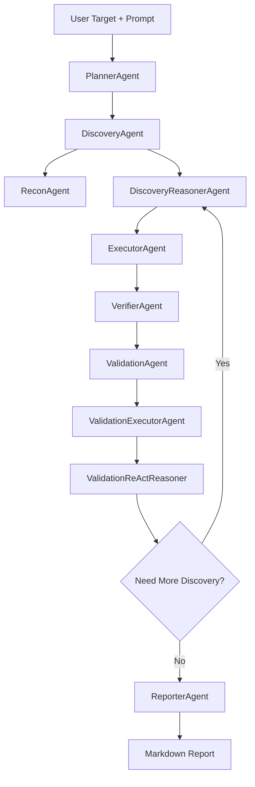

# AutoFlow

AutoFlow 是一个面向授权安全评估、靶场测试和内部红队演练的多智能体渗透测试自动化框架原型。项目使用 LangGraph 编排多阶段工作流，接入 OpenAI-compatible LLM 做规划、推理和工具调用决策，并通过 Docker 工具容器执行安全工具。Redis 用于运行时记忆和 LangGraph checkpoint，为多轮推进、中断恢复和后续审批流打基础。

> AutoFlow 仅用于已授权目标、靶场环境或内部安全评估。请不要用于未授权系统。

## 项目目标

AutoFlow 的目标不是简单封装扫描命令，而是把一次安全评估拆成可追踪、可复盘、可扩展的自动化流程：

- 根据用户输入的目标、授权范围和测试意图创建评估任务。
- 自动采集端口、Web 页面结构、路径、API、安全头、技术栈等信息。
- 让 LLM 基于当前上下文、历史记忆和可用工具清单分析攻击面。
- 生成下一步测试计划，并调用 Docker 容器内工具执行。
- 将工具输出沉淀为统一的 `ToolObservation`。
- 从观测结果中提取候选脆弱点 `Finding`。
- 为候选 Finding 生成验证计划 `ValidationPlan`。
- 使用 ValidationReAct 执行真实验证动作，形成 `ValidationResult`。
- 汇总资产、证据、验证结果和修复建议，生成 Markdown 报告。

## 整体架构

AutoFlow 可以理解为：

```text
用户输入
  -> LangGraph 工作流
  -> 多 Agent 推理
  -> LLM function calling
  -> Docker 工具容器
  -> ToolObservation / Finding / ValidationResult
  -> Redis Memory + Artifacts
  -> Markdown Report
```

核心层次：

- 工作流编排层：LangGraph 负责节点编排、状态流转、分支路由和 checkpoint。
- Agent 推理层：Planner、DiscoveryReasoner、Verifier、Validation、ValidationReAct、Reporter 协作推进任务。
- 工具执行层：ToolDispatcher、Executor、ScriptRunner、ShellRunner 负责把 LLM tool call 落到容器内执行。
- 记忆与产物层：Redis 保存运行时记忆和 checkpoint，`data/artifacts` 保存原始证据，`data/reports` 输出报告。

## Pipeline



数据沉淀链路：

```text
Tool Output
  -> ToolObservation
  -> ToolSignal
  -> Candidate Finding
  -> ValidationPlan
  -> ValidationResult
  -> Report
```

## Agent 职责

### PlannerAgent

理解用户输入、授权范围和评估意图，创建顶层评估计划。Planner 负责决定初始任务方向，不直接执行扫描或漏洞验证。

### DiscoveryAgent

发现阶段入口，组合确定性的 Recon 能力和 LLM 推理能力。

- `ReconAgent` 负责端口、Web 页面、基础路径、技术栈等事实采集。
- `DiscoveryReasonerAgent` 基于 recon、历史记忆、已有 Finding 和工具清单生成攻击面分析与 TestPlan。

### ReconAgent

负责事实采集，不承担复杂漏洞推理。它更像工具编排器，会调用 nmap、whatweb、nuclei、nikto、curl、web recon 等工具获取目标结构和基础暴露面。

### DiscoveryReasonerAgent

真正的发现阶段推理 Agent。它会读取 memory pack、工具观测、Web recon、已有 Finding 和工具 manifest，让 LLM 判断下一步应该继续看哪里、用什么工具、预期获得什么证据。

### ExecutorAgent

执行 `TestPlanAction`。它会将测试动作转换为容器内工具调用、脚本执行或受控 shell 执行，并将结果统一写回状态和 artifact。

### VerifierAgent

从工具输出中识别明确风险信号，将原始观测提升为候选 Finding。Verifier 负责判断“这个扫描结果是否值得进入验证阶段”。

### ValidationAgent

根据候选 Finding 生成验证计划。比如 API 暴露、目录 listing、debug endpoint、弱安全头、公开配置文件、CORS 配置等不同类型，会生成不同的复现和验证动作。

### ValidationExecutorAgent

执行验证计划中的具体动作，并调用 ValidationReActReasoner 对验证证据做最终判断。

### ValidationReActReasoner

验证阶段的 ReAct Agent。它会读取 Finding、记忆、历史工具结果和可用工具 schema，自行选择工具调用、读取返回结果、继续调用工具或结束验证。

当前已加入证据门槛机制：即使 LLM 返回 `confirmed`，系统也会按漏洞类型做后置检查。证据不足时会自动降级为 `inconclusive`，并写入缺失证据。

例如：

- SQL 注入不能只因为单引号返回结果变化就确认，必须有 sqlmap 或等价证据、数据库错误、布尔差异、时间差异或元数据提取证据。
- API 暴露需要证明匿名或测试身份下 2xx 访问，并有响应体样本、JSON key、业务数据或敏感字段证据。
- CORS 需要原始响应头证据；如果声称敏感数据可读，还需要对应敏感接口响应体证据。
- IDOR 需要跨用户、跨对象或有无认证对比证据。
- SSRF 需要回连、metadata、内网服务响应或等价服务端请求证据。

### ReporterAgent

汇总资产、工具观测、Finding、验证计划、验证结果和修复建议，生成 Markdown 报告。

## 工具调用模型

AutoFlow 不让 LLM 直接执行宿主机命令。LLM 看到的是工具 schema 和工具说明，通过 function calling 发起调用：

```text
LLM
  -> tool_calls
  -> ToolDispatcher
  -> Docker Tool Container / WebRecon / ScriptRunner / Memory Tools
  -> tool result
  -> LLM continues reasoning
```

命令行工具、shell 动作和脚本动作都应在 Docker 工具容器中执行，不直接使用宿主机 shell。

## 当前工具能力

工具是否可用取决于镜像构建、`configs/tools.yaml`、`configs/tool_manifest.yaml` 和本地环境配置。

常见目标扫描与 Web 测试工具：

- `nmap`
- `curl`
- `whatweb`
- `httpx`
- `nikto`
- `nuclei`
- `dirsearch`
- `gobuster`
- `ffuf`
- `feroxbuster`
- `naabu`
- `subfinder`
- `testssl.sh`
- `sslscan`
- `wafw00f`
- `sqlmap`

凭据、服务和网络枚举工具：

- `hydra`
- `medusa`
- `smbclient`
- `enum4linux`
- `smbmap`

源码与制品分析工具：

- `trivy`
- `bandit`
- `gitleaks`
- `semgrep`

内置工具：

- `read_agent_memory`
- `list_known_targets`
- `search_observations`
- `web_recon_fetch_page`
- `run_shell__bounded_bash`
- `run_script__security_headers_check`
- `run_script__api_endpoint_probe`
- `run_script__cors_probe`
- `run_script__debug_endpoint_probe`
- `run_script__directory_listing_probe`
- `run_script__public_config_probe`
- `run_script__custom_validation`

## 记忆机制

AutoFlow 当前包含两类持久化能力。

### Redis Runtime Memory

用于保存评估过程中的运行时记忆：

```text
latest_state
memory_pack
events
observations
findings
validation_plans
validation_results
```

Agent 执行前会读取并合并 Redis 中的 `memory_pack`，执行后再刷新记忆。这样后续 Agent 能继承前面扫描、观察和验证阶段得到的信息。

### LangGraph Redis Checkpointer

用于保存 LangGraph checkpoint，后续可用于：

- 中断恢复。
- 审批后继续执行。
- 长任务失败后恢复。
- 多轮流程状态追踪。

## 目录结构

```text
autoflow/
  agents/          Agent 实现
  api/             API 与后续前端接入
  artifacts/       原始证据与报告产物存储
  db/              数据库模型与仓储
  domain/          项目、任务、Finding 等领域模型
  executor/        Docker 工具执行、脚本执行、shell 执行
  flows/           AssessmentFlow 业务状态
  graph/           LangGraph 节点、边、构图与 checkpoint
  llm/             LLM 客户端
  memory/          Agent memory 与 Redis memory
  observations/    工具输出解析与风险信号提取
  policy/          风险策略与审批策略
  reporting/       报告生成
  runtime/         运行时 action 标准化
  scheduler/       调度、锁、冲突检测与心跳
  tools/           LLM tool schema、dispatcher、manifest

configs/
  app.yaml             应用配置
  agents.yaml          Agent 配置
  kali.yaml            Docker/Kali 执行环境配置
  policy.yaml          风险与审批策略
  tools.yaml           可执行工具 profile
  tool_manifest.yaml   暴露给 LLM 的工具说明
  tool_installs.yaml   容器缺失工具安装白名单

docker/
  autoflow-kali-tools/ 工具镜像定义与模板

scripts/
  build_tool_image.py
  check_tool_image.py
  check_redis_connection.py
  check_redis_checkpoint.py
  test_llm_connection.py
  run_assessment.py
  run_stepwise_assessment.py

docs/
  architecture.md
  agent-workflow.md
  kali-adapter.md
  safety-policy.md
```

## 环境要求

- Python 3.11+
- Docker
- Redis 或 Redis Stack
- OpenAI-compatible LLM API

## 安装

```bash
python -m pip install -e .
python -m pip install -e ".[dev]"
```

复制环境变量模板：

```bash
cp .env.example .env
```

Windows PowerShell：

```powershell
Copy-Item .env.example .env
```

关键配置示例：

```env
LLM_MODEL=your-model
LLM_BASE_URL=https://your-llm-provider.example/v1
LLM_API_KEY=your_api_key

REDIS_ENABLED=true
REDIS_URL=redis://your-redis-host:6379/0
REDIS_KEY_PREFIX=autoflow

CHECKPOINT_BACKEND=redis
```

不要把真实 API key、Redis 密码或靶场私有信息提交到仓库。

## 构建工具镜像

```bash
python scripts/build_tool_image.py --tag autoflow-kali-tools:latest
```

检查镜像内工具：

```bash
python scripts/check_tool_image.py --image autoflow-kali-tools:latest
```

## 基础检查

测试 LLM 连接：

```bash
python scripts/test_llm_connection.py
```

测试 Redis 连接：

```bash
python scripts/check_redis_connection.py
```

测试 Redis checkpoint：

```bash
python scripts/check_redis_checkpoint.py --thread-id autoflow-checkpoint-smoke
```

## 运行评估

分阶段运行，适合观察每一步输出：

```bash
python scripts/run_stepwise_assessment.py \
  --target http://target.example:3001 \
  --project demo-assessment \
  --max-rounds 2 \
  --output data/reports/demo-assessment.md
```

使用确定性 Planner 跑受控链路：

```bash
python scripts/run_stepwise_assessment.py \
  --target http://target.example:3001 \
  --project controlled-e2e \
  --offline-planner \
  --execute-limit 2 \
  --validation-execute-limit 2 \
  --max-rounds 1 \
  --output data/reports/controlled-e2e.md
```

使用 LangGraph Redis checkpoint：

```bash
python scripts/run_assessment.py \
  --target http://target.example:3001 \
  --project checkpoint-demo \
  --checkpoint-backend redis \
  --thread-id checkpoint-demo \
  --output data/reports/checkpoint-demo.md
```

Windows PowerShell 可以使用反引号换行：

```powershell
python scripts/run_stepwise_assessment.py `
  --target http://target.example:3001 `
  --project demo-assessment `
  --max-rounds 2 `
  --output data/reports/demo-assessment.md
```

## 测试

```bash
python -m pytest -q
```

针对验证推理：

```bash
python -m pytest tests/unit/test_validation_reasoner_agent.py -q
```

## 输出结果

运行后主要产物：

```text
data/artifacts/
  工具原始输出、脚本输出、结构化结果

data/reports/
  Markdown 报告

Redis
  latest_state、memory_pack、events、observations、findings、validation_plans、validation_results
```

## 安全边界

- 仅允许对授权范围内目标执行任务。
- Discovery 阶段以只读和低风险动作为主。
- 中高风险验证动作后续应接入审批流和审计流。
- 工具真实风险以 `configs/tools.yaml` 中的 profile 为准。
- 原始大输出写入 artifact，不直接塞入 LLM 上下文。
- 任何脚本、shell、命令行工具都应在 Docker 工具容器内执行。
- 源码和制品扫描只访问受控目录。

## 当前状态

已具备：

- LangGraph 多阶段工作流。
- Docker 容器化工具执行。
- LLM function calling 工具循环。
- DiscoveryReasoner 基于记忆和工具清单生成测试计划。
- ToolObservation 到 Candidate Finding 的提升。
- ValidationPlan 生成。
- ValidationReAct 验证推理和工具调用。
- 验证结果证据门槛与不足证据降级。
- Redis memory 和 Redis checkpoint 基础能力。
- Markdown 报告输出。

仍需继续完善：

- 审批流与高风险动作恢复执行。
- 更细粒度的并行调度和冲突控制。
- 更完整的漏洞复现策略库。
- 更稳定的长链路 LLM JSON 输出与重试机制。
- 更接近交付级渗透测试报告的报告模板。
- 前端交互界面、任务可视化和人工审核台。

## 相关文档

- `docs/architecture.md`
- `docs/agent-workflow.md`
- `docs/kali-adapter.md`
- `docs/safety-policy.md`
- `README-AUTOFLOW-ARCHITECTURE.md`
- `version0.6.md`
